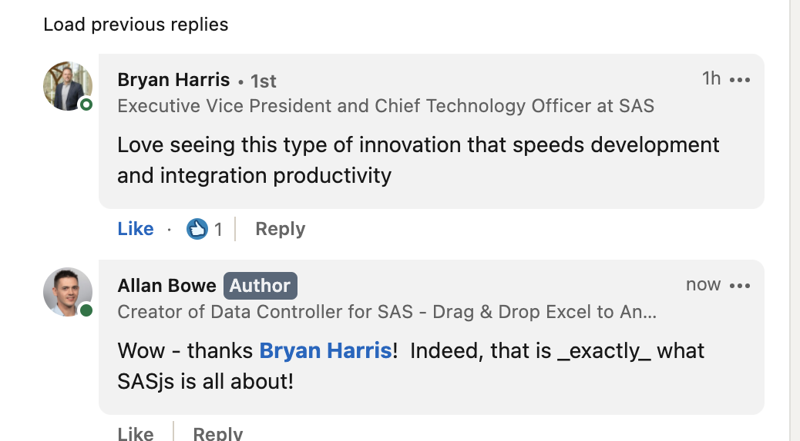

<!--
npx @marp-team/marp-cli slides/4gl.md -o 4gl/index.html --html=true

-->

# About 4GL Apps

## Custom Interfaces to SAS

---

<!-- header:  -->

# Who We Are

- UK Ltd
- SAS Subcontractor (UK, Sweden, USA, Belgium)
- SAS Consulting + Web Development

---
<!-- header:  -->

# Where We Operate

Top Regions (2023):
- Germany
- UK
- Sweden
- Canada

---
# Sales Breakdown

 

---

<!-- header:  -->

# Products

|Data Controller for SAS®|SASensei|SASjs|
|:---:|:---:|:---:|
||||

_Plus SCL Transcoding Kit_

---

<!-- header:  -->

# What is Data Controller?

- Controlled Data Capture
- Governance
- Exploration

_Designed for Regulated Industries_

---

# Why use Data Controller?

- Eliminate cost of entire Design/Dev/Test/Promote resource
- Ingest 'invisible' data into SAS (silos, EUCs)
- Audit Trail for Business-Sourced data

---

# Partners

- Analytium (UK SAS Partner)
- Laco (Belgian SAS Partner)
- Notilyze (Netherlands SAS Partner)
- Selerity (Australian SAS Partner)

---

# Where Data Controller is most useful:

- Regulated Industries - require evidence for audit
  - Fraud, Insurance, Banking, Pharma
- Customer needs to load Excel into SAS
- Customer needs to maintain reference data

---

<!-- header:  -->

#  What is SASjs?

- Set of open source tools
  - rapid, bespoke SAS interfaces
- A Framework
  - tests, docs, deploys etc

_Enables a deployable PoC within the first 2 weeks of a project, typically_

---

## SASjs Stats

- Over 55k downloads
- ~ 20 contributors
- 35 Repositories

---

# Why use SASjs?

- Maintain velocity as complexity increases
- Faster, higher quality iterations
- Rapid on-boarding 🧍🧍🧍
- Tests & Documentation

---

# Why Open Source?

- Bigger audience = more testing / product feedback
- Better for customer
  - no vendor lockin
  - Reduced friction (proposals etc)
  - Lower risk
- More contributors
  - Faster product development

---

<!-- header:  -->

# 4GL Apps - Services

- Modernisation - AF/SCL + SAS/Intrnet
- Migration - SAS9 web apps to Viya
- Manifestation - new interfaces to SAS
- Support (DC, Bespoke Apps, SASjs)

---
# Use Case 1 - DWP

Multi-user, complex AF/SCL based data management process - dealing with survey data, applying derived variables and imputation for different use cases / customer groups

Project won at tender in partnership with SAS UK, delivered using SASjs and Data Controller in just 8 months

---
# Use Case 2 - Informa

Analysis of shipping data to identify 'dark movements' (no GPS / potential piracy)

Large data volumes, multi-developer project team, Viya platform

Delivered through SAS Belgium, making use of SASjs CLI to handle automated deployments and solution version control

---
# Use Case 3 - Canada Western Bank

Careful ingestion of mapping and reference data to support Basel III reporting flows

Required column and row level security for ingestion, also ability to extract specific cells and ranges from Excel

Delivered as official features within Data Controller under a direct relationship

---
# Use Case 4 - Der Touristik

Looking to replace a complex, VBA centric reporting tool to eliminate spreadsheet risk in the planning process

Delivered as bespoke web app in combination with Data Controller for handling the ingestion components

---
# Use Case 5 - AFA Insurance

Blocked from upgrading to 9.4m8 due to reliance on Information Delivery Portal component which allowed updates to a mapping table whilst displaying related data _on the same screen_.

Delivered as a new feature in Data Controller (viewboxes)

---

# Resources

- https://sasjs.io/resources
- https://datacontroller.io
- https://github.com/sasjs
- https://slides.sasjs.io
- https://core.sasjs.io
- https://cli.sasjs.io
- https://sasapps.io

---
# Conversations?

- Bids / Proposals
- Implementation projects
- Account management
- Presales support
