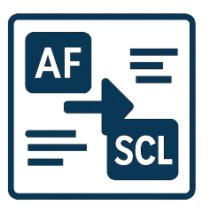

<!--
npx @marp-team/marp-cli slides/about.md -o about/index.html --html=true
-->

# About 4GL Apps

## Custom Interfaces to the world's most powerful Analytics Platform

<!-- a bit about my background -->

---

<!-- header:  -->

# Who We Are

- UK Company
- SAS Subcontractor (UK, USA, Belgium, Sweden)
- Focus on SAS-Powered Web Apps

---

<!-- header:  -->

# Products

|Data Controller for SAS®|AF/SCL Transcoding Kit|SASjs|
|:---:|:---:|:---:|
||||

---
# 4GL Apps - Services

- Modernisation (AF/SCL + SAS/Intrnet)
- Migration (STP web apps to Viya)
- Manifestation
- Support

---

# Projects

- 400 user AF/SCL modernisation, 8 months, Allianz UK
- AF/SCL Data Management system, 8 months, UK Gov Dept
- Demand Planning Tool, 3 months, Der Touristik (Germany)
- SOAP Interface to Viya, 3 weeks, Swedish Gov Dept
- AF/SCL Modernisation, 5 months, US Gov

_Plus many more_

---

# What is Data Controller?

- **Controlled Data Capture**
- Data Quality & Data Governance
- Data Exploration

_Designed for Regulated Industries_

---

# Why use Data Controller?

- Eliminate entire Design/Dev/Test/Promote resource cost
- Ingest 'invisible' data into SAS (silos, EUCs)
- Automatic Data Quality at source

---

# Data Controller Customers

- Belgium: Allianz + 2 more insurers
- Canada: Bank
- Denmark: Bank
- Germany: Siemens Healthineers, Der Touristik
- Sweden: AFA Insurance
- UK: Goverment Dept

Plus desktop users around the world

---

# Where Data Controller is most useful:

- Regulated Industries - require evidence for audit
- Customer ingests complex excel data
- Significant business data capture

---

# What is SASjs?

1. An Opinionated Approach - _which led to the development of:_
2. A Collection of Tools
    - [@sasjs/cli](https://github.com/sasjs/cli) - automated [deployments](https://cli.sasjs.io/cbd) (CI/CD), [docs](https://cli.sasjs.io/doc) and [tests](https://cli.sasjs.io/test)
    - [@sasjs/core](https://github.com/sasjs/core) - '00s of macros for AppDev
    - [@sasjs/vscode-extension](https://github.com/sasjs/adapter) - Battery Pack for VS Code
    - [@sasjs/server](https://server.sasjs.io) - build apps on Base SAS
    - SASjs [Seed Apps](https://github.com/search?q=topic%3Asasjs-seed-app+org%3Asasjs+fork%3Atrue&type=repositories)

_MIT open source / free for commercial use_

---

## SASjs Stats

- Core Downloads: 
- SASjs Stars 
- Core Contributors: 

---

## SASjs Workflow

<!-- build on current platform, deploy later to new -->

---

# Why use SASjs?

- Maintain velocity as complexity increases
- Faster, higher quality iterations
- Rapid on-boarding 🧍🧍🧍
- Tests & Documentation

---

# Where SASjs is most useful:

- Delivering complex SAS solutions (programming based)
- Integrating SAS with other technologies
- Bespoke User Interfaces

---

# AF/SCL

- AF + SCL
- Catalog Centric
- Manual Deployment

---

# Modern Apps

- JS + SAS
- GIT / DB Centric
- Continuous Integration

---

## Phase 0 - Estimate + Initial Interface

1. Prepare
2. Propose
3. Produce

_Fixed Price, 2 weeks_
_Entirely Offsite_

---

# Resources

- https://sasjs.io/resources
- https://datacontroller.io
- https://github.com/sasjs
- https://slides.sasjs.io
- https://core.sasjs.io
- https://cli.sasjs.io
- https://sasapps.io

