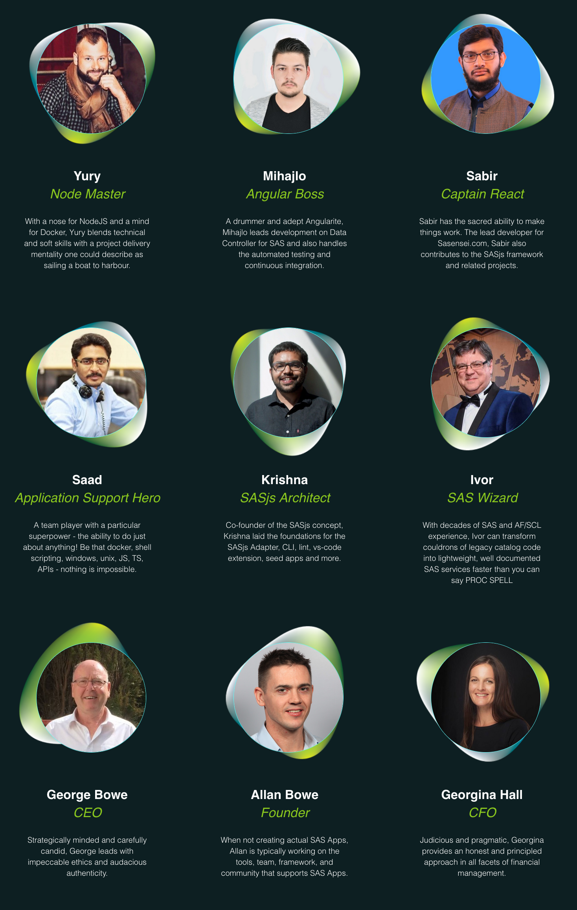
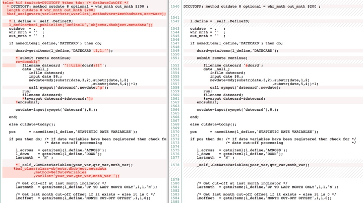

<!--
npx @marp-team/marp-cli slides/af-intro.md -o af-intro/index.html --html=true
-->

<!-- header:  -->

# SAS AF/SCL Modernisation

---
<!-- header:  -->
# About 4GL Apps

[SAS App](https://sasapps.io):

- **Migration** - STP Web Apps to Viya
- **Modernisation** - AF/SCL + SAS IntrNet to Web
- **Manifestation** - New Apps & Interfaces

---

# Who We Are

- Core Developers
- Management
- SASjs Partner Network

---

<!-- header:  -->

# Products

|Data Controller for SAS®|SASensei|SASjs|
|:---:|:---:|:---:|
||||

_Plus SCL Transcoding Kit_

---

# Projects

- 400 user AF/SCL modernisation, 8 months, Allianz
- AF/SCL Data Management system, 8 months, UK Gov Dept
- SOAP Interface to Viya, 3 weeks, Swedish Gov Dept

_Plus many more_

---

# AF/SCL

- AF + SCL
- Catalog Centric
- Manual Deployment

---

# AF/SCL Future

|SAS|Not SAS|
|:---:|:---:|
|Viya|Python|
|SAS 9 EBI|R Shiny|
|SASjs Server|Java|

---

# Modern Apps

- JS + SAS
- GIT / DB Centric
- Continuous Integration

---

## SASjs Workflow

---
# Tools / Accelerators

- SASjs [CLI](https://cli.sasjs.io) - automated [deployments](https://cli.sasjs.io/cbd), [docs](https://cli.sasjs.io/doc) and [tests](https://cli.sasjs.io/test)
- SASjs [adapter](https://adapter.sasjs.io) - flavour-agnostic comms
- SASjs [core](https://core.sasjs.io) - hundreds of macros for AppDev
- SASjs [Seed Apps](https://github.com/search?q=topic%3Asasjs-seed-app+org%3Asasjs+fork%3Atrue&type=repositories)
- SCL Transcoding Kit - re-use existing SCL logic

---
# SCL Kit
## After / Before

---

# Rebuffals

|Topic|Prognosis|
|---|---|
|Inertia|✅ _Vastly superior UX and lower maintenance / upgrade costs_|
|Resource Availability|✅ _Code review + carefully planned video interviews for minimal customer impact_ |
|?? Scope|✅  _Phase 0 estimation followed by regular (functional) deliveries_|
|House of Cards|✅ _Deliver **offsite** with sample data_|
|It won't work|✅ _Two Week Fixed Price POC_|
|Cost|✅ _Code + Platform re-use (+ SASjs) makes for rapid delivery_|
<!--
15-30 minute daily standups mandatory
what use and what DON'T use
offsite generally means MUCH faster iterations
-->

---

# Project Approach

- Preparation (code/doc review, exploratory interviews)
- Initial Proposal (as is, to be, rough estimates)
- Phase 0 (confirm estimates, scope, initial env setup + interface)
- Phase 1-N (functional deliveries + docs + tests with each milestone)
- Testing & Warranty (X days over X months)
- Support / SLA Proposal (IF preferred vendor)

---
# Documentation

_Continuously delivered - NOT at the end of the project_

- [User Guide](https://sasjs.github.io/docs/#/?id=%2fuser-guide%2fuser-overview)
- [Admin Guide](https://sasjs.github.io/docs/#/admin-guide/admin-overview)
- [Developer Guide](https://sasjs.github.io/docs/#/developer-guide/developer-overview)
- [SAS Docs](https://core.sasjs.io/) (doxygen / sasjs doc)
- [JS Docs](https://adapter.sasjs.io/) (TypeDoc)

---
## Testing & Warranty

- Customer Satisfaction Insurance
- Deployment & Training
- Support - https://sasapps.io/support
---
# Resources

- SAS Apps [Blog Post](https://sasapps.io/modernising-legacy-sas-scl-af-applications)
- Easy AF [article](https://www.linkedin.com/pulse/easy-af-scl-modernisation-html5-sas-allan-bowe/)
- UK SAS Forum [presentation](https://drive.google.com/file/d/1RMLxFccaXYh35IGnbcFjISFmZUIdetUO/view)
- RawSAS [post](https://rawsas.com/modernising-legacy-sas-scl-af-applications/)
- Youtube [video](https://www.youtube.com/watch?v=G_M1t6hTMJQ)
- Technical [AF Slides](https://slides.sasjs.io/af-scl)

