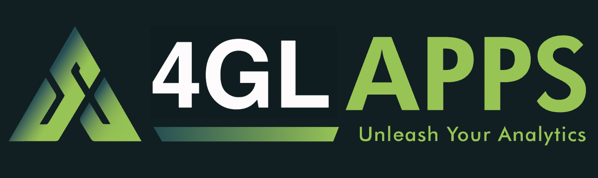
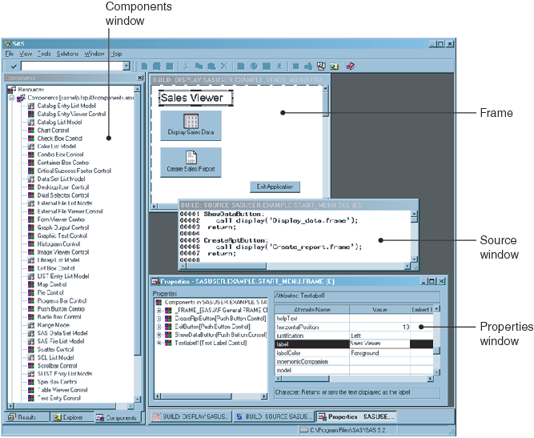
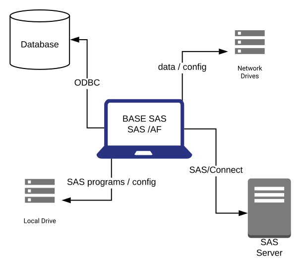
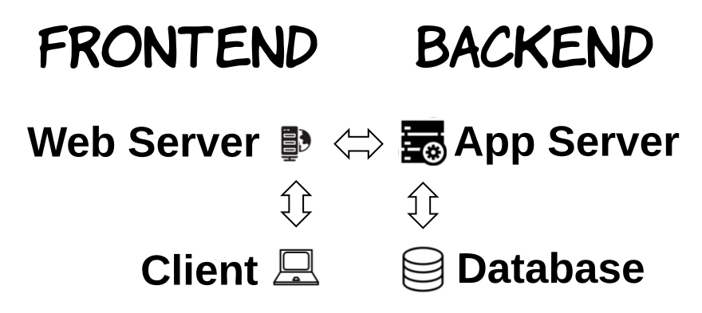
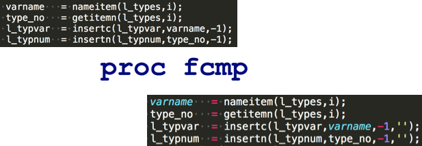
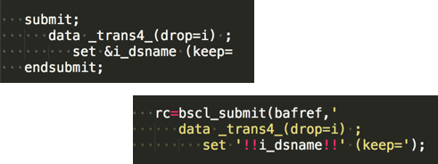
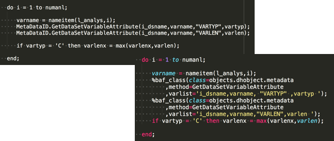
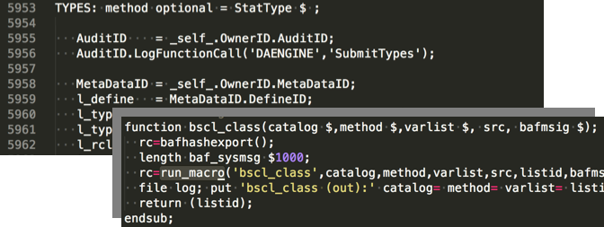
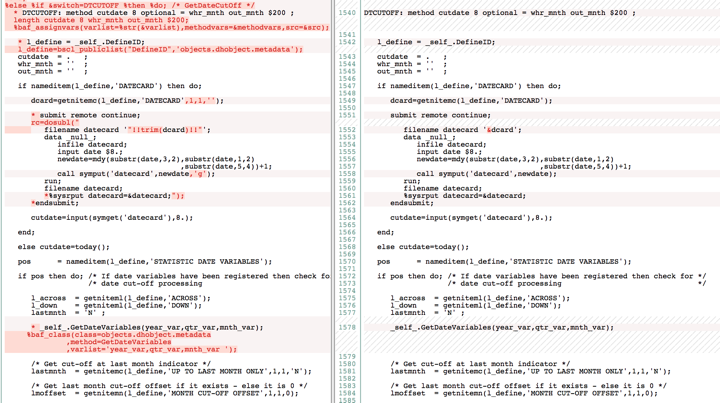

<!-- header:  -->

# SAS AF/SCL Modernisation

---
<!-- header:  -->
# About 4GL Apps

_[SAS App](https://sasapps.io) Migration, Modernisation & Manifestation_

|Products|Services|Customers|
|:---:|:---:|:---:|
|[SASjs](https://sasjs.io) - DevOps for SAS|SAS 9 SPWA Migration|Europe|
|[SASensei](https://sasensei.com) - 5000 players|AF/SCL + SAS IntrNet Modernisation|UK|
|[Data Controller for SAS](https://datacontroller.io)|SAS App Development|Canada|

---
# AF/SCL

- AF + SCL
- Catalog Centric
- Manual Deployment

---

# Modern Apps

- JS + SAS
- GIT / DB Centric
- Continuous Integration

---
# Pain / Gain

| |Pain|Gain|
|---|---|---|
|SECURITY|End user identity, embedded passwords..|SASLogon, LDAP, SSO|
|SCALABILITY|Messy, Manual, Desktop Deploys|CI/CD to cloud instance|
|SUPPORT|Highly specialist, customer specific|Commodity Skill, Industry Standard Frameworks|

---
# Project Objections

|Topic|Suffering|
|---|---|
|❌ Inertia| _App worked fine for decades. Why change it?_|
|❌ Resource Availability| _We're all super busy and the developer quit in 2003. Documentation? Ha!_|
|❌ Scope Uncertainty|_Theres so much code & complexity, this project is guaranteed to cost more and take longer_|
|❌ House of Cards| _Our data is sensitive, and our infrastructure brittle - systems access is also super difficult to obtain_|

---
# Rebuffals

|Topic|Prognosis|
|---|---|
|Inertia|✅ _Vastly superior UX and lower maintenance costs_|
|Resource Availability|✅ _Code review + carefully planned interviews for minimal customer impact_ |
|Scope Uncertainty|✅  _Phase 0 estimation followed by regular production deliveries_|
|House of Cards|✅ _Deliver offsite with sample data_|

<!--
15-30 minute daily standups mandatory
what use and what DON'T use
offsite generally means MUCH faster iterations
-->

---
# Success Factors

🎯 Business WANTS the upgrade
🎯 IT support for regular deployments
🎯 Internal champion(s) on daily calls & milestones

---
# Project Approach

- Preparation (pre-sales)
- Initial Proposal (pre-sales)
- Phase 0 (estimates and initial interface)
- Phase 1-N (milestones with 1 week accept or explain)
- Testing & Warranty (X days over X months)
- Support / SLA Proposal (IF preferred vendor)

---

## Preparation

_To prepare a meaningful proposal, we must know what we are proposing!_

 - Code scan
 - Doc review
 - Recorded interview
---
## Initial Proposal

 - Vendor Neutral (open source)
 - Tailored to Customer (preparation stage)
 - Full Details of:
   - Delivery Team
   - SASjs Framework
   - Project Approach
---

## Phase 0

_Don't trust - verify (applies both ways). 1-2 weeks depending on project size._

 - Detailed Plan + Estimates + ARIaD
 - Environment setup (driven from GIT repo)
 - Basic Interface with integrated docs
 - Initial services, tests, ci/cid

 ---

## Subsequent Phases - Functional

 - Daily Calls
 - Deliver early, deliver often
 - Documentation (user, admin guides)
 - End of Phase demonstration

---
## Subsequent Phases - Backend

- SCL elimination
  - SAS Jobs & Web Services (STP / JES)
  - SCL Transcoding where necessary
- Catalog elimination
  - SLISTs -> Database
  - Code -> Source Control (GIT)
- Tests (sasjs test, test data)
- Documentation (sasjs doc + user / developer guides)
---
## Subsequent Phases - Frontend

_Working from inputs/outputs defined in SAS Service Header_

- Tests (specs + cypress)
- Documentation (TypeDoc + Developer docs)
- Accessibility Requirements

---
## Testing & Warranty

- Customer Satisfaction Insurance
- Deployment & Training
- Support
---

# SASjs Tools

- [sasjs/cli](https://github.com/sasjs/cli) - commands include `sasjs deploy`, `sasjs test` and `sasjs doc`
- [sasjs/adapter](https://github.com/sasjs/adapter) - clean & robust JS <-> SAS connectivity
- [sasjs/core](https://github.com/sasjs/core) - hundreds of open source macros for Application Development

---
# More Tools

- [Data Controller](https://datacontroller.io) - business data capture
- [SASjs Seed Apps](https://github.com/search?q=topic%3Asasjs-seed-app+org%3Asasjs+fork%3Atrue) - rapid project initiation
- [SASjs Server](https://server.sasjs.io) - pipeline tests, mocked services

---

<header style="text-align: right">     &nbsp;&nbsp;&nbsp;&nbsp;&nbsp;&nbsp; SCLssssssssssssssssssssssssss </header>

# SCL Kit
## Functions

---
# SCL Kit
## Submit Blocks

---
# SCL Kit
## Object Methods

---
# SCL Kit
## Method Blocks

---
# SCL Kit
## After / Before

---
# Documentation

_Continuously delivered - NOT at the end of the project_

- [User Guide](https://sasjs.github.io/docs/#/?id=%2fuser-guide%2fuser-overview)
- [Admin Guide](https://sasjs.github.io/docs/#/admin-guide/admin-overview)
- [Developer Guide](https://sasjs.github.io/docs/#/developer-guide/developer-overview)
- [SAS Docs](https://core.sasjs.io/) (doxygen / sasjs doc)
- [JS Docs](https://adapter.sasjs.io/) (TypeDoc)

---
# Testing

_Continuously delivered - NOT at the end of the project_

- [`sasjs test`](https://cli.sasjs.io/test)
- JS specs
- Cypress (interface tests)

---
# Resources

- SAS Apps [Blog Post](https://sasapps.io/modernising-legacy-sas-scl-af-applications)
- Easy AF [article](https://www.linkedin.com/pulse/easy-af-scl-modernisation-html5-sas-allan-bowe/)
- UK SAS Forum [presentation](https://drive.google.com/file/d/1RMLxFccaXYh35IGnbcFjISFmZUIdetUO/view)
- RawSAS [post](https://rawsas.com/modernising-legacy-sas-scl-af-applications/)
