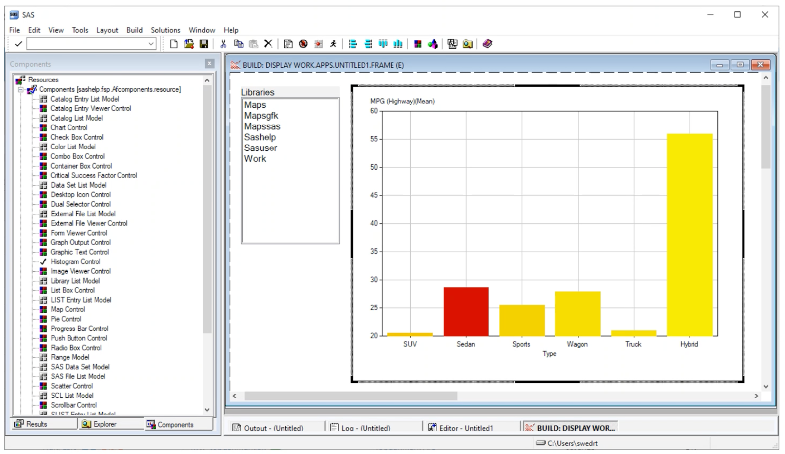
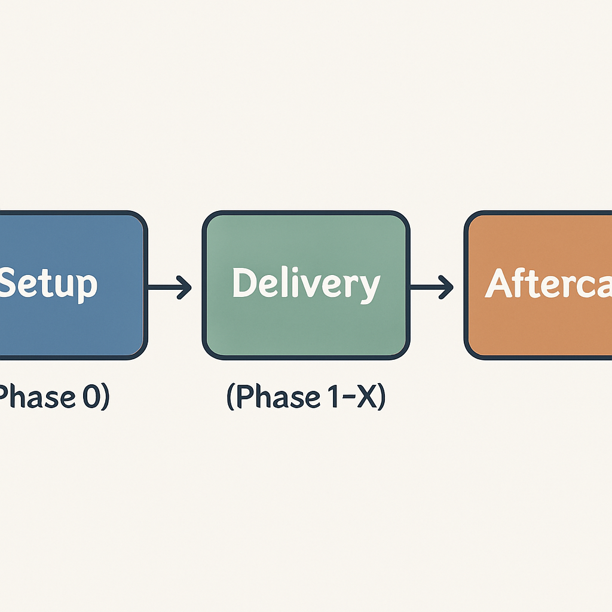
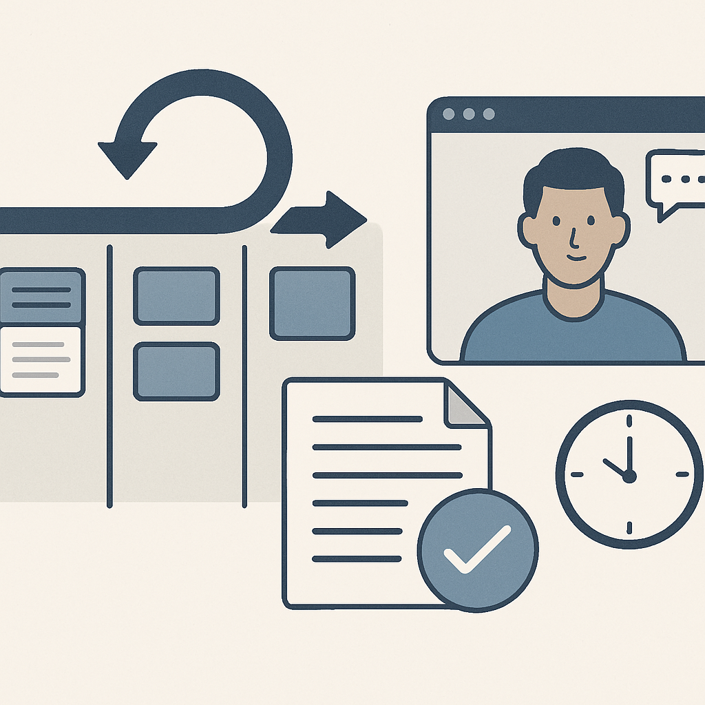
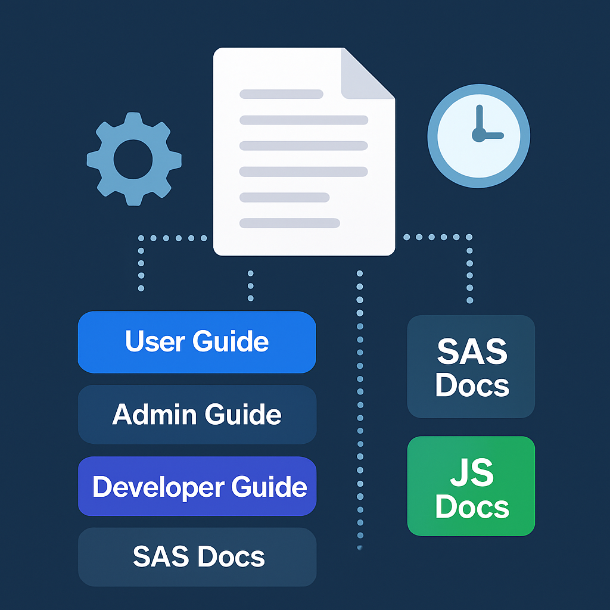
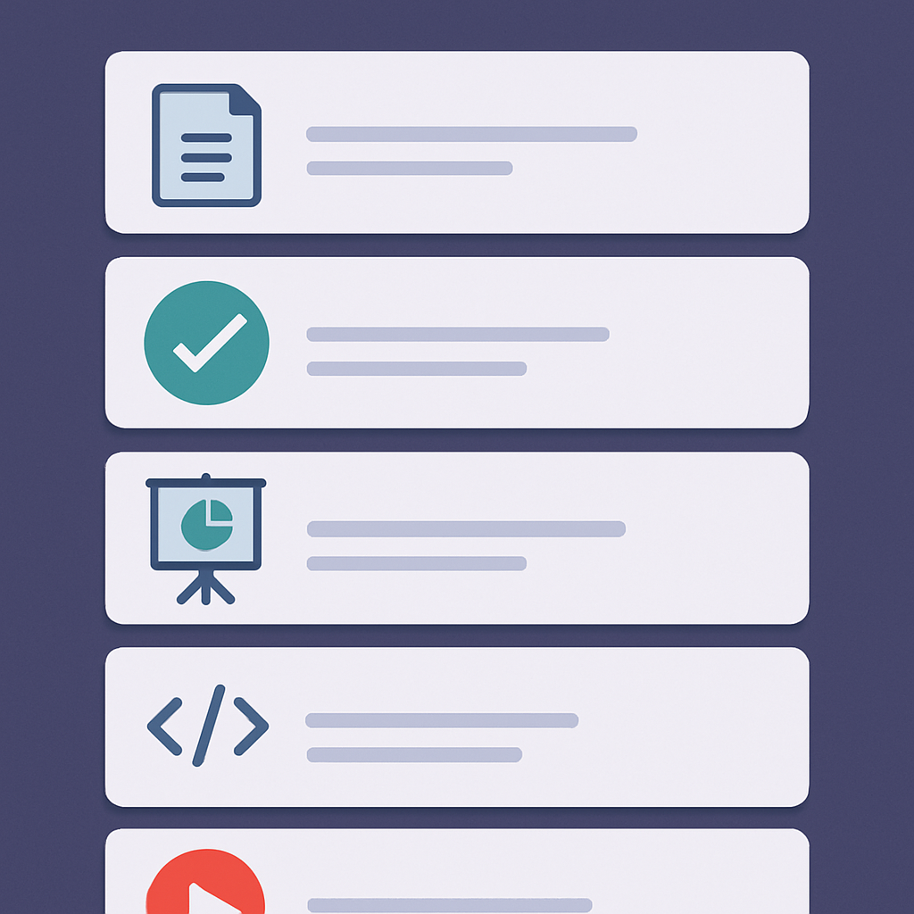

<!--
npx @marp-team/marp-cli slides/af.md -o af/index.html --html=true
-->

<!-- header:  -->

# SAS AF/SCL Modernisation

---
<!-- header:  -->
# About 4GL Apps

_We help SAS customers migrate, modernise & manifest [SAS Apps](https://sasapps.io) using modern tools and a standardised development approach_

---

# Success Story #1

## Allianz Insurance, UK

_Enabled a cloud SAS migration through redevelopment of 400 user AF/SCL application used for Financial Modelling, Reporting, and Claims Triangles_

- Team: 1 backend (SAS), 2 Frontend (Angular)
- Duration: 8 months

---

# Success Story #2

## Department of Work & Pensions, UK

_Modernisation of a 10-user AF/SCL Data Management app used for ingestion, transformation / modelling, and publishing of survey / census data._

- Team: 1.5 backend (SAS), 1.5 Frontend (React + Angular)
- Duration: 6 months

---

# Success Story #3

## USDA, USA

_Functional Proof of Concept and migration plan (with costings) for two large-scale survey processing systems._

- Team: 2 backend (SAS), 1.5 Frontend (React)
- Duration: 3 months

---

# AF/SCL Apps

❌ AF + SCL
❌ Catalog Centric
❌ Manual Deployment

---

# Web Apps

✅ JS + SAS
✅ GIT / DB Centric
✅ Continuous Integration

---

# Project Concerns #1

|Topic|Suffering|Prognosis|
|---|---|---|
|Inertia|❌ _App worked fine for decades. Why change it?_|✅ _Vastly superior UX and lower maintenance / upgrade costs_|
|Resource Availability|❌ _We're all super busy and the developer quit in 1999._|✅ _Code review + carefully planned video interviews for minimal customer impact_ |

---

# Project Concerns #2

|Topic|Suffering|Prognosis|
|---|---|---|
|Scope Uncertainty|❌ _The complexity will cost us 💰💰💰 and take ⏱️⏱️⏱️_|✅  _Phase 0 estimation + regular (functional) deliveries_|
|House of Cards|❌ _Our data is sensitive, our infrastructure is brittle - systems access is difficult to obtain_|✅ _Deliver **offsite** with sample data, deploy onsite to new environment_|

---

# 4GL Apps Project Approach

- Setup (Phase 0)
- Delivery (Phase 1-X)
- Aftercare

---

# Project Setup (Phase 0)

- Product Research
  - code/doc review, user interviews
- Environment setup
    - GIT repo, sample data, server
- Plan + Estimates (for rest of project)

---

# Project Delivery (Phase 1-X)

- Regular sprints with functional, deployable software
- Documentation / tests updated continuously
- Daily calls with product champion(s)

---

# Project Aftercare

- Testing & Warranty (X days over X months)
- Training
- Ongoing Support & Maintenance
  - https://sasapps.io/support

---

# Documentation

_Continuously delivered - NOT end of project_

- [User Guide](https://sasjs.github.io/docs/#/?id=%2fuser-guide%2fuser-overview)
- [Admin Guide](https://sasjs.github.io/docs/#/admin-guide/admin-overview)
- [Developer Guide](https://sasjs.github.io/docs/#/developer-guide/developer-overview)
- [SAS Docs](https://core.sasjs.io/) (SASjsDoc)
- [JS Docs](https://adapter.sasjs.io/) (TypeDoc)

---

## End Result

A user-friendly, accessible, modern UI

- Will run on both Viya and SAS 9 EBI
- Maintainable by generic frontend / backend developers
- Supportable by the client, or any vendor (not just 4GL Apps)

---

# Tools

- SASjs (DevOps for SAS)
- Data Controller (controlled data ingestion)
  - Resulted in a 30% cost saving (~3 months) on DWP project
- SCL Transcoding Kit (re-use of SCL logic, where necessary)

---

# Resources

- SAS Apps [Blog Post](https://sasapps.io/modernising-legacy-sas-scl-af-applications)
- Easy AF [article](https://www.linkedin.com/pulse/easy-af-scl-modernisation-html5-sas-allan-bowe/)
- UK SAS Forum [presentation](https://drive.google.com/file/d/1RMLxFccaXYh35IGnbcFjISFmZUIdetUO/view)
- RawSAS [post](https://rawsas.com/modernising-legacy-sas-scl-af-applications/)
- Youtube [video](https://www.youtube.com/watch?v=G_M1t6hTMJQ)
