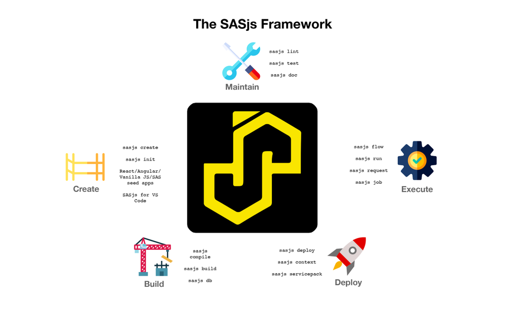

<!-- header:  -->

# About 4GL Apps

_Delivery, Enablement, & Support_

⚠️ Stop me if I go too fast! ⚠️

<!-- both web and api based interfaces.  contrasts with other partners focused on ETL or migration work. -->

---
<!-- header:  -->

# Company Overview

 - UK Ltd, 9 years
 - SAS UK Subcontractor
 - 7 developers - 5 JavaScript, 2 SAS

Focus: **SAS Solutions**

---

# Products

- Data Controller for SAS® - for regulated industries
- Sasensei - quiz game with 5000 SAS geeks
- SASjs - DevOps Framework

---

# Services

- Bootstrap complex SAS projects with our GIT centric approach
- Modernise AF/SCL or SAS/IntrNet Apps
- Migrate SAS 9 Web Apps to Viya

---

# Challenges with Traditional SAS Project

- Scattered Artefacts > _Hard to navigate - changes are lost_
- Shared Environment > _Edits affect everyone_
- Single Server >  _Migration Management_

 

🤬🤬🤬 **The absence of a _standardised framework_ makes for _inconsistent project delivery_ and _on-boarding struggles_ for new developers**

<!--
For SAS 9 each dev could have a dedicated RACE image, harder with Viya though

Macros on filesystem, Code split between Jobs and Studio programs,
 -->
---

## SASjs Workflow

---

---

# SASjs Projects

- Push to Any or Many > _Server Agnostic_
- Centralised Artefacts > _Source Controlled_
- Isolated Developer Environments > _Move Fast and Break Things_

 

✅ Highly suitable where SAS Programming is involved
❌ Needs additional work for graphical artefacts (VA, Flows etc)

---
# Why Do SAS Developers ❤️ It?

 - Use preferred IDE > _VS Code / Sublime / Vim_
 - Access to the terminal > _Shell scripts, Python_
 - Access to local applications > _GIT GUI / Doxygen_

---
# Why Do SAS Admins ❤️ It?

 - Nothing to install on the SAS server
 - No SSH or special permissions (server OR desktop)
 - Nothing to configure, except:
     - Optional: Access to the target folder
     - Optional: Client / Secret (Viya)
     - Optional: SAS 9 setting for encoded passwords

---
# Why Do Project Leads ❤️ It?

 - Faster to on-board new developers
 - Ability to work on multiple features in parallel
 - Complete visibility of what is being developed

---

# Actual Deployments

- Department of Work & Pensions (with SAS UK)
- Lloyds List Intelligence (with SAS Belgium)
- SKR Association (with SAS Sweden)

<!-- Plus Data Controller for SAS -->
---

# What is SASjs?

1. An Opinionated Approach - _which led to the development of:_
2. A Collection of Tools
    - [@sasjs/cli](https://github.com/sasjs/cli) - CI/CD and Automated Deployment
    - [@sasjs/core](https://github.com/sasjs/core) - Macro library
    - [@sasjs/vscode-extension](https://github.com/sasjs/adapter) - Battery Pack for VS Code

<!-- optionated - working locally, git centric, server agnostic -->

---
# Pre Requisites

|Required|Recommended|Recommended|
|---|---|---|
|||

To install the CLI:  `npm i -g @sasjs/cli`

---

# Core Features

- `sasjs compile` > _Create self-contained Jobs, Services & Tests_
- `sasjs build` > _Prepare deployment pack (JSON / SAS Program)_
- `sasjs deploy` > _Send to the target location_

---

# Running SAS

- `sasjs run` > _Execute arbitrary SAS code_
- `sasjs job execute` > _Run a Job_
- `sasjs flow execute` > _Run a collection of Jobs_

---

# Being a Responsible Developer

- `sasjs test` > _Trigger one or more Tests_
- `sasjs lint` > _Check Code Quality / Best Practices_
- `sasjs doc` > _Doxygen Documentation (+ Lineage)_

More commands at https://cli.sasjs.io

---
## Compilation - Scaffolding Consistency

---
## Compilation Components

_Targets are compiled by reference to the dependencies listed in the Doxygen header._

- Artefacts: **Jobs, Services, Tests**
- Dependencies: **Macros, Includes, Binary Files**
- Optional Frontend - convert a web project into a [streaming app](https://sasapps.io/blog/).

---
## SASjs Config File

Every SASjs Project has a `sasjs/sasjsconfig.json` file, for configuration of:

 - Location of Artefacts (+ Dependencies & Init/Term programs)
 - Macro Variables
 - Target attributes / connection settings

---
# SASjs Target

A location on a SAS server. Can be specific to individual developers, or shared location such as a release environment.

Core attributes:

 - `name` > Alias for SASjs commands, eg: `sasjs deploy -t dev3`
 - `serverUrl` > Protocol + Host + Port
 - `serverType` > either `SASVIYA`, `SAS9` or `SASJS`
 - `appLoc` > Root deployment folder in SAS Drive or Metadata

 Plus any target specific overrides - ie macro variables, artefact / dependency locations etc.

---
# Demo

`sasjs create mydemo --template jobs`
`sasjs lint`
`sasjs doc`
`sasjs auth`
`sasjs cbd`
`sasjs test`

---

# Resources

- https://sasjs.io/resources
- https://datacontroller.io
- https://github.com/sasjs
- https://cli.sasjs.io
- https://sasapps.io
