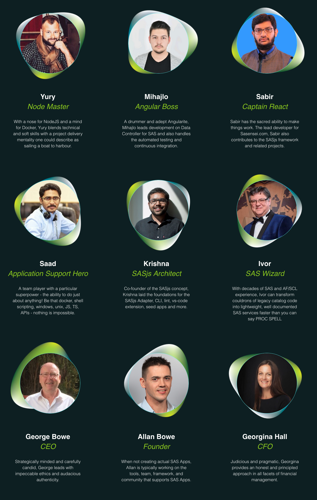
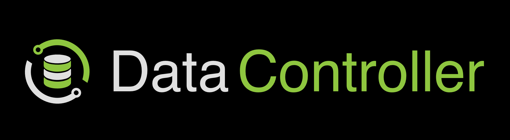
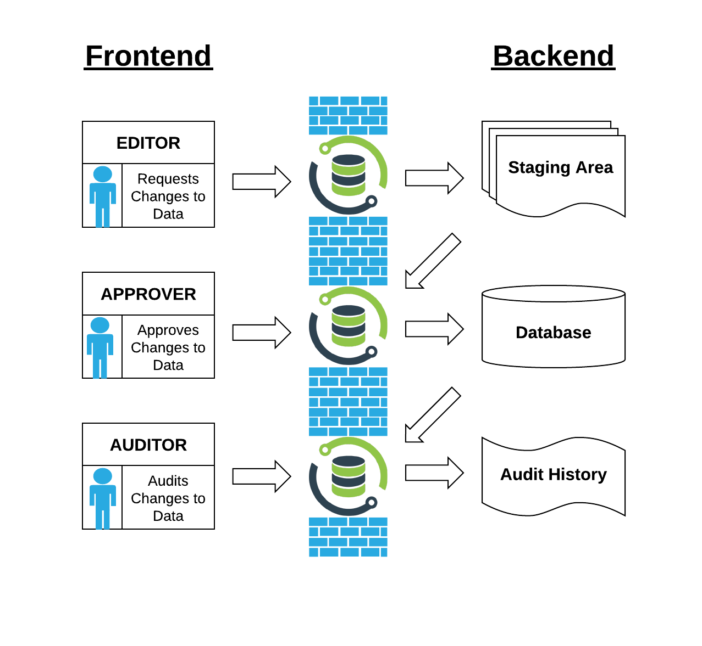
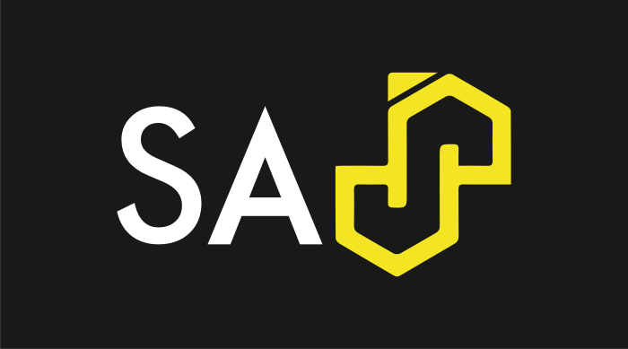
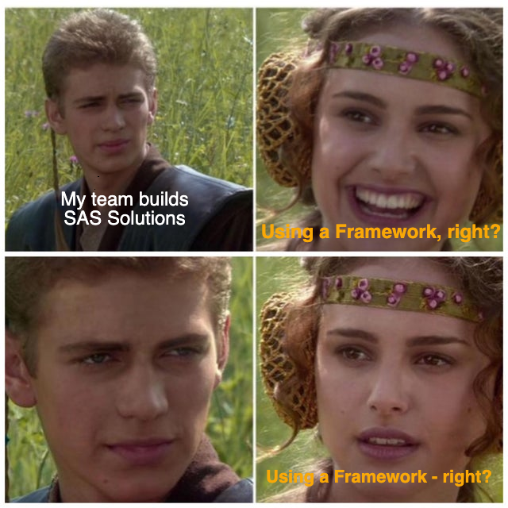
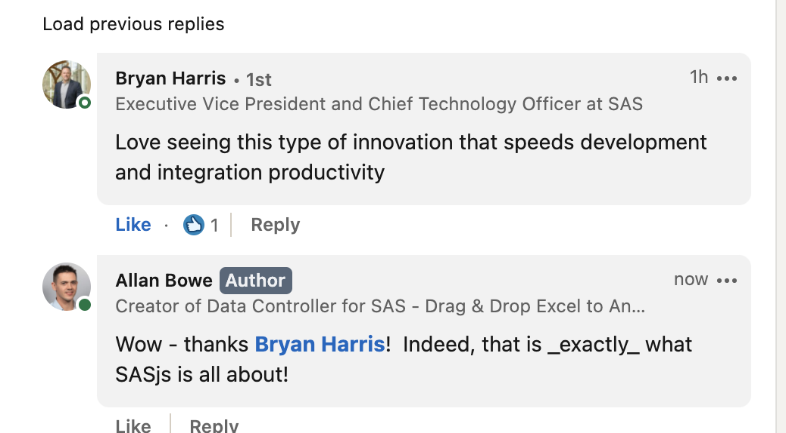
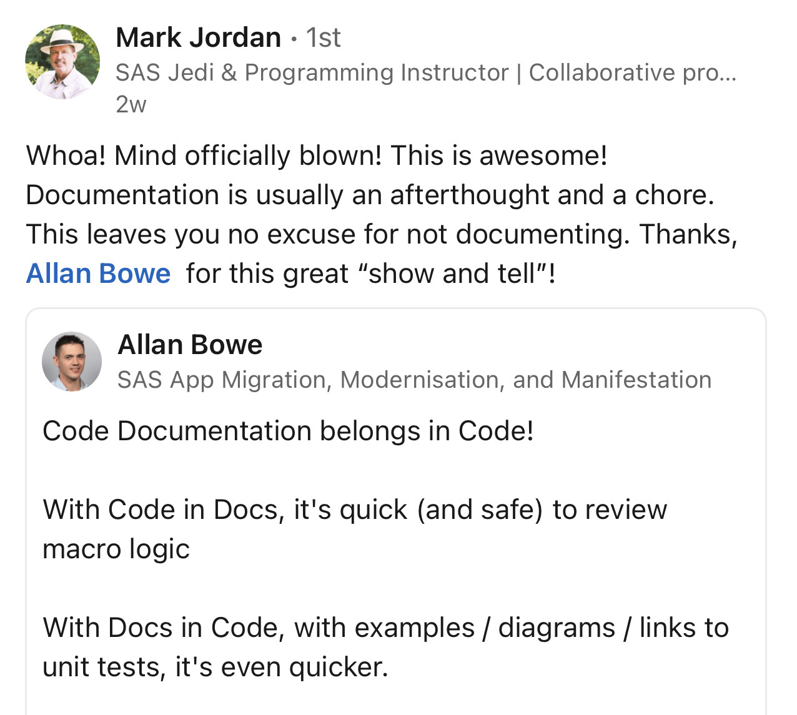
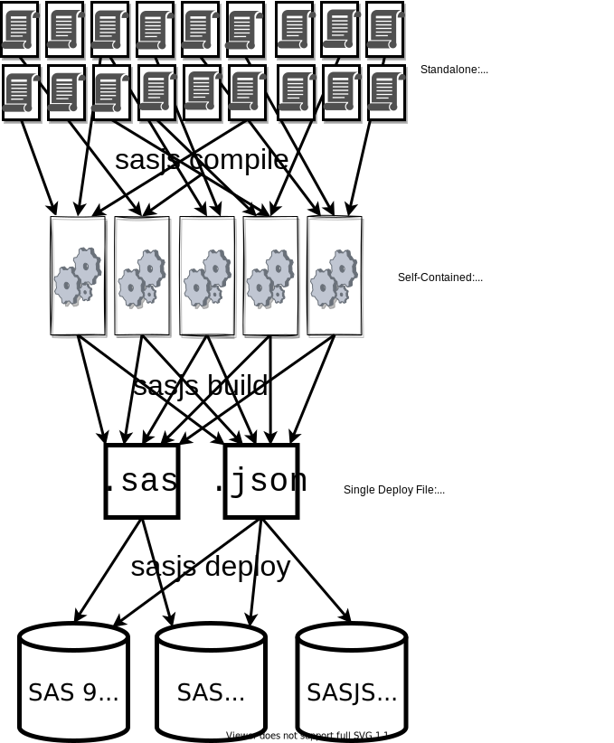

<!--
npx @marp-team/marp-cli slides/fans23.md -o fans23/index.html --html=true
-->

<!-- header:  -->

# Modernising SAS Apps

_If I go too fast_:
 - stop me
 - visit [slides.sasjs.io](https://slides.sasjs.io/fans23)
 - book me to present to your team

<!-- a bit about my background -->

---

<!-- header:  -->

# Who We Are

- UK Company
- SAS Subcontractor
- Focus on SAS Solutions

---
# Services

- Modernisation (AF/SCL + SAS/Intrnet)
- Migration (STP web apps to Viya)
- Manifestation
- Support

---

# Projects

- 400 user AF/SCL modernisation, 8 months, Allianz UK
- AF/SCL Data Management system, 8 months, UK Gov Dept
- Demand Planning Tool, 3 months, Der Touristik (Germany)
- SOAP Interface to Viya, 3 weeks, SKR (Sweden)

_Plus many more_

---

<!-- header:  -->

# Products

|[Data Controller for SAS®](https://datacontroller.io)|[SASensei](https://sasensei.com)|[SASjs](https://github.com/sasjs)|
|:---:|:---:|:---:|
|  _Angular_| _React_| _Typescript_|

_Plus SCL Transcoding Kit_

---

<!-- header:  -->

# What is Data Controller?

- Controlled Data Capture
- Governance
- Exploration

_Designed for Regulated Industries_

---

# Why use Data Controller?

- Eliminate entire Design/Dev/Test/Promote resource cost
- Ingest 'invisible' data into SAS (silos, EUCs)
- Automatic Data Quality at source
- Showcase Lineage (SAS9)

---

# Data Controller Demo

- Editing
- SAS Logs
- Docs

---
<!-- header:  -->

# What is SASjs?

## An Opinionated Approach to SAS Solution Development

- Modular vs Monolithic
- Local vs Remote Development
- IDE vs GUI

Enables continuous deployment and test-driven, GIT-native development

---

# Why use SASjs?

- Maintain velocity as complexity increases
- Faster, higher quality iterations
- Rapid on-boarding 🧍🧍🧍

---
<!-- header:  -->

# SASjs Tools
  - [@sasjs/cli](https://github.com/sasjs/cli) - automated [deployments](https://cli.sasjs.io/cbd) (CI/CD), [docs](https://cli.sasjs.io/doc) and [tests](https://cli.sasjs.io/test)
  - [@sasjs/vscode-extension](https://github.com/sasjs/adapter) - Battery Pack for VS Code
  - [@sasjs/adapter](https://adapter.sasjs.io) - connectivity between client & SAS
  - [@sasjs/core](https://github.com/sasjs/core) - '00s of macros for AppDev
  - [@sasjs/lint](https://github.com/sasjs/lint) - quality check your SAS code
  - [@sasjs/server](https://server.sasjs.io) - build apps on Base SAS

  - SASjs [Seed Apps](https://github.com/search?q=topic%3Asasjs-seed-app+org%3Asasjs+fork%3Atrue&type=repositories)

---
<!-- header:  -->
## SASjs Stats

- ~ 55k downloads
- ~ 20 contributors
- 35 Repositories

---

## SASjs Workflow

<!-- build on current platform, deploy later to new -->

---
# SASjs Core

- ~250 macros for application development
- Documentation + Tests
- Base SAS, Viya, Metadata, SASjs Server, FCMP, LUA

https://core.sasjs.io

---
# SASjs Server - Use Cases for Viya Apps

- Portal for secure / organised frontend deployment
- Create mocked Stored Programs in JS, Python or R
  - Build frontend / run pipelines, where SAS unavailable
- Build on Base SAS / Deploy to Viya

https://server.sasjs.io

<!--  _Open source Mid-Tier & REST API over Foundation SAS_
LDAP, Permissions, Users & Groups, Stored Programs etc
-->
---
# SASjs Adapter

## Authentication & Communication

- Docs: https://adapter.sasjs.io
- Demo: https://www.youtube.com/watch?v=WwGptgvSqSw&t=14s

---

# SASjs VS Code Extension

**FOSS** - VS Codium and Theia support. Key Features:

- Code Execution in all flavours of SAS
- Code Documentation (`sasjs doc`)
- Directory Synchronisation (`sasjs fs sync`)
- Linting and Formatting (`sasjs lint`)

---

# `sasjs doc`

- Doc-Site from SAS Headers
- DoxyConfig Manager
- Lineage

_Both CLI and VS Code Extension_

Demo: [xieliaing](https://github.com/xieliaing/SAS) and jobs (for lineage)

---

# `sasjs lint`

- Configurable severity level (ERROR / WARNING)
- Use in GIT HOOK or pipeline
- 16 rules / settings and counting

_Both CLI and VS Code Extension_

Demo: jobs

---

# SASjs CLI - Execution

- `sasjs run` > _Execute arbitrary SAS code_
- `sasjs job execute` > _Run a Job_
- `sasjs flow execute` > _Run a collection of Jobs_

_Requires authentication - let's look at deployment first_

---

# `sasjs cbd` (compile, build, deploy)

* Run the same project on different server types
* Eliminate need for physical directories (SASAUTOS)
* Package frontend as streaming app

_Demo - Mario_

---
<!-- header:  -->

# SASjs Primary Artefacts

|Type|I/O|Returns|
|---|---|---|
|Job|Data Inputs / Outputs|Success / Error|
|Service|Web Inputs / Outputs|JSON / Other Content Types|
|Test|N/A|Pass / Fail Object|

Services & Tests are compiled with `%webout()` macros, for generating JSON in SASjs format.  See also: [https://cli.sasjs.io/artefacts/](https://cli.sasjs.io/artefacts/)

---

# SASjs Secondary Artefacts

These items are bundled into each Primary Artefact when listed in the program header:

- **SAS Macros** - one macro per file, lowercase filenames
- **SAS Includes** - arbitrary sas code, formats, lua, etc
- **Binary Files** - excel, pdf, images, mp3, mp4
- **initProgram** - executes before the Job / Service / Test
- **termProgram** - executes after the Job / Service / Test

---
## SASjs Config File

Every SASjs Project has a `sasjs/sasjsconfig.json` file, for configuration of:

 - Primary / Secondary Artefact folders
 - Macro Variables
 - Target attributes / connection settings

---
# 🎯 SASjs Target 🎯

*A location on a SAS server*

Core attributes:

 - `name` > Alias for SASjs commands, eg: `sasjs deploy -t dev3`
 - `serverUrl` > Protocol + Host + Port
 - `serverType` > either `SASVIYA`, `SAS9` or `SASJS`
 - `appLoc` > Root deployment folder in SAS Drive or Metadata

---

# `sasjs cbd` Syntax

- `sasjs compile`: _Self-contained Jobs, Services, Tests_
- `sasjs build`: _Deployment pack (JSON / SAS Program)_
- `sasjs deploy`: _Send to target_

Compile/Build/Deploy project to myTarget:  `sasjs cbd -t mytarget`

---

# Running Tests

---
# `sasjs test` Syntax

Execute all tests (default target): `sasjs test`

Execute tests in "macros" folder: `sasjs test /macros/`

Prevent pipeline fail: `sasjs test --ignoreFail`

Execute all tests starting with "mv_" and save the output in 'myresults' folder

`sasjs test mv_ --outDirectory /somedir/myresults`

---

# Resources

- https://sasjs.io/resources
- https://datacontroller.io
- https://github.com/sasjs
- https://slides.sasjs.io
- https://core.sasjs.io
- https://cli.sasjs.io
- https://sasapps.io

---

# Contact

📅 https://4gl.io/cal
💬 https://4gl.io/chat
🎺 https://4gl.io/social
🔗 https://www.linkedin.com/in/allanbowe
