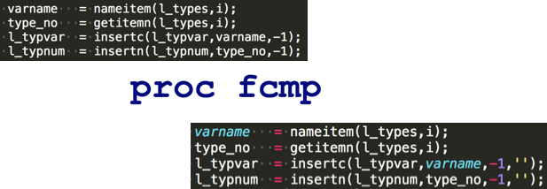
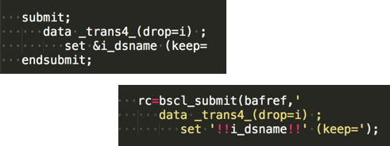
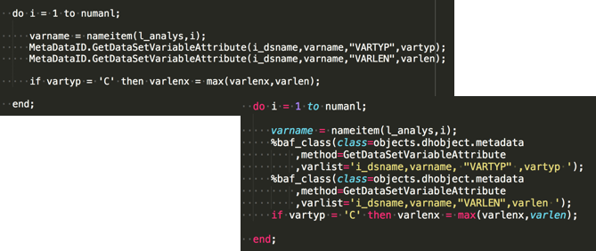

<!--
npx @marp-team/marp-cli slides/fans23.md -o fans23/index.html --html=true
-->

<!-- header:  -->

# Modernising Legacy SAS Applications

_If I go too fast_:
 - stop me
 - visit [slides.sasjs.io](https://slides.sasjs.io/fans23)
 - book me to present to your team

<!-- a bit about my background -->

---

<!-- header:  -->

# Who We Are

- UK Company
- SAS Subcontractor
- Focus on SAS Solutions

---
# Services

- Modernisation (AF/SCL + SAS/Intrnet)
- Migration (STP web apps to Viya)
- Manifestation
- Support

<!--
  How we do it, replace frontend, re-use backend as stateless services
-->

---

# Projects

- 400 user AF/SCL modernisation, 8 months, Allianz UK
- AF/SCL Data Management system, 8 months, UK Gov Dept
- Demand Planning Tool, 3 months, Der Touristik (Germany)
- SOAP Interface to Viya, 3 weeks, SKR (Sweden)

_Plus many more_

<!--
Each project has improved SASjs and Data Controller
-->

---

<!-- header:  -->

# Products

|[Data Controller for SAS®](https://datacontroller.io)|[SASensei](https://sasensei.com)|[SASjs](https://github.com/sasjs)|
|:---:|:---:|:---:|
|  _Angular_| _React_| _Typescript_|

_Plus SCL Transcoding Kit_

---

# AF/SCL Apps

❌ AF + SCL
❌ Catalog Centric
❌ Manual Deployment

---

# Web Apps

✅ JS + SAS
✅ GIT / DB Centric
✅ Continuous Integration

---

# Project Concerns #1

|Topic|Suffering|Prognosis|
|---|---|---|
|Inertia|❌ _App worked fine for decades. Why change it?_|✅ _Vastly superior UX and lower maintenance / upgrade costs_|
|Resource Availability|❌ _We're all super busy and the developer quit in 1999._|✅ _Code review + carefully planned video interviews for minimal customer impact_ |

---

# Project Concerns #2

|Topic|Suffering|Prognosis|
|---|---|---|
|Scope Uncertainty|❌ _The complexity will cost us 💰💰💰 and take ⏱️⏱️⏱️_|✅  _Phase 0 estimation + regular (functional) deliveries_|
|House of Cards|❌ _Our data is sensitive, our infrastructure is brittle - systems access is difficult to obtain_|✅ _Deliver **offsite** with sample data, deploy onsite to new environment_|

---

# 4GL Apps Project Approach

- PreSales
- Delivery
- Aftercare

---

# 4GL Apps Project Approach

## PreSales

- Preparation (code/doc review, exploratory interviews)
- Initial Proposal (as is, to be, rough estimates)

---
## Delivery

- Phase 0 (confirm estimates, scope, initial env setup + interface, fixed price)
- Phase 1-N (functional deliveries + docs + tests with each milestone)

---

# 4GL Apps Project Approach

## Aftercare

- Testing & Warranty (X days over X months)
- Training
- Ongoing Support & Maintenance (IF preferred vendor)
  - https://sasapps.io/support

---
# Documentation

_Continuously delivered - NOT at the end of the project_

- [User Guide](https://sasjs.github.io/docs/#/?id=%2fuser-guide%2fuser-overview)
- [Admin Guide](https://sasjs.github.io/docs/#/admin-guide/admin-overview)
- [Developer Guide](https://sasjs.github.io/docs/#/developer-guide/developer-overview)
- [SAS Docs](https://core.sasjs.io/) (SASjsDoc)
- [JS Docs](https://adapter.sasjs.io/) (TypeDoc)

---

## End Result

A user-friendly, accessible, modern UI that can:

- run on both Viya and EBI
- be maintained by generic frontend / backend developers
- be maintained by the client, or any vendor (not just 4GL Apps)

---

# Tools

- SASjs (DevOps for SAS) - Open Source
- Data Controller (controlled data ingestion)
  - Resulted in a 30% cost saving (~3 months) on DWP project
- SCL Transcoding Kit (re-use of SCL logic, where necessary)

---

<header style="text-align: right">     &nbsp;&nbsp;&nbsp;&nbsp;&nbsp;&nbsp; SCLssssssssssssssssssssssssss </header>

# SCL Kit
## Functions

---
# SCL Kit
## Submit Blocks

---
# SCL Kit
## Object Methods

---
# SCL Kit
## Method Blocks

---
# SCL Kit
## After / Before

---

# SAS/FSP

 - FSBROWSE: View one record at a time
 - FSEDIT: Edit one record at a time
 - FSVIEW: View or edit a table of data

Much of the above functionality is available in [Data Controller for SAS®](https://datacontroller.io). The remaining parts are fairly trivial to build as standalone web apps.

---
<!-- header:  -->

# What is Data Controller?

- Controlled Data Capture
- Governance
- Exploration

_Designed for Regulated Industries_

---

# Why use Data Controller?

- Eliminate entire Design/Dev/Test/Promote resource cost
- Ingest 'invisible' data into SAS (silos, EUCs)
- Automatic Data Quality at source
- Showcase Lineage (SAS9)

---

# Data Controller Demo

- Editing (tables, format catalogs, datasets)
- SAS Logs
- Docs - https://docs.datacontroller.io
- Code - https://code.datacontroller.io

---
<!-- header:  -->

# SASjs

## The DevOps Framework for SAS Apps

---
# Why use SASjs?

- Maintain velocity as complexity increases
- Faster, higher quality iterations
- Rapid on-boarding 🧍🧍🧍

---

# What is SASjs?

## An Opinionated Approach to SAS Solution Development

- Modular vs Monolithic
- Local vs Remote Development
- IDE vs GUI

Enables continuous deployment and test-driven, GIT-native development

---

## SASjs Workflow

---
<!-- header:  -->

# SASjs Tools
  - [@sasjs/cli](https://github.com/sasjs/cli) - automated [deployments](https://cli.sasjs.io/cbd) (CI/CD), [docs](https://cli.sasjs.io/doc) and [tests](https://cli.sasjs.io/test)
  - [@sasjs/vscode-extension](https://github.com/sasjs/adapter) - Battery Pack for VS Code
  - [@sasjs/adapter](https://adapter.sasjs.io) - connectivity between client & SAS
  - [@sasjs/core](https://github.com/sasjs/core) - '00s of macros for AppDev
  - [@sasjs/lint](https://github.com/sasjs/lint) - quality check your SAS code
  - [@sasjs/server](https://server.sasjs.io) - build apps on Base SAS

  - SASjs [Seed Apps](https://github.com/search?q=topic%3Asasjs-seed-app+org%3Asasjs+fork%3Atrue&type=repositories)

---
<!-- header:  -->
## SASjs Stats

- ~ 55k downloads
- ~ 20 contributors
- 35 Repositories

---
# SASjs Core

- ~250 macros for application development
- Documentation + Tests
- Base SAS, Viya, Metadata, SASjs Server, FCMP, LUA

https://core.sasjs.io

---
# SASjs Server - Use Cases for Viya Apps

- Portal for secure / organised frontend deployment
- Create mocked Stored Programs in JS, Python or R
  - Build frontend / run pipelines, where SAS unavailable
- Build on Base SAS / Deploy to Viya

https://server.sasjs.io

<!--  _Open source Mid-Tier & REST API over Foundation SAS_
LDAP, Permissions, Users & Groups, Stored Programs etc
-->
---
# SASjs Adapter

## Authentication & Communication

- Docs: https://adapter.sasjs.io
- Demo: https://www.youtube.com/watch?v=WwGptgvSqSw&t=14s

---

# SASjs VS Code Extension

**FOSS** - VS Codium and Theia support. Key Features:

- Code Execution in all flavours of SAS
- Code Documentation (`sasjs doc`)
- Directory Synchronisation (`sasjs fs sync`)
- Linting and Formatting (`sasjs lint`)

---

# `sasjs doc`

- Doc-Site from SAS Headers
- DoxyConfig Manager
- Lineage

_Both CLI and VS Code Extension_

Demo: [xieliaing](https://github.com/xieliaing/SAS) and jobs (for lineage)

---

# `sasjs lint`

- Configurable severity level (ERROR / WARNING)
- Use in GIT HOOK or pipeline
- 16 rules / settings and counting

_Both CLI and VS Code Extension_

Demo: jobs

---

# SASjs CLI - Execution

- `sasjs run` > _Execute arbitrary SAS code_
- `sasjs job execute` > _Run a Job_
- `sasjs flow execute` > _Run a collection of Jobs_

_Requires authentication - let's look at deployment first_

---

# `sasjs cbd` (compile, build, deploy)

- Run the same project on different server types
- Eliminate need for physical directories (SASAUTOS)
- Package frontend as streaming app

_Demo - Mario, React_

---
<!-- header:  -->

# SASjs Primary Artefacts

|Type|I/O|Returns|
|---|---|---|
|**Job**|_Data Inputs / Outputs_|Success / Error|
|**Service**|_Web Inputs / Outputs_|JSON / Other Content Types|
|**Test**|_N/A_|Pass / Fail Object|

Services & Tests are compiled with `%webout()` macros, for generating JSON in SASjs format.  See also: [https://cli.sasjs.io/artefacts/](https://cli.sasjs.io/artefacts/)

---

# SASjs Secondary Artefacts

These items are bundled into each Primary Artefact when listed in the program header:

- **SAS Macros** - one macro per file, lowercase filenames
- **SAS Includes** - sas snippets, fcmp, lua, datalines, ddl etc
- **Binary Files** - excel, pdf, images, mp3, mp4, zip
- **initProgram** - executes before the Job / Service / Test
- **termProgram** - executes after the Job / Service / Test

---
## SASjs Config File

Every SASjs Project has a `sasjs/sasjsconfig.json` file, for configuration of:

 - Primary / Secondary Artefact folders
 - Macro Variables
 - Target attributes / connection settings

---
# 🎯 SASjs Target 🎯

*A location on a SAS server*

Core attributes:

 - `name` > Alias for SASjs commands, eg: `sasjs deploy -t dev3`
 - `serverUrl` > Protocol + Host + Port
 - `serverType` > either `SASVIYA`, `SAS9` or `SASJS`
 - `appLoc` > Root deployment folder in SAS Drive or Metadata

---

# `sasjs cbd` Syntax

- `sasjs compile`: _Self-contained Jobs, Services, Tests_
- `sasjs build`: _Deployment pack (JSON / SAS Program)_
- `sasjs deploy`: _Send to target_

Compile/Build/Deploy project to myTarget:  `sasjs cbd -t mytarget`

---

# Running Tests

---
# `sasjs test` Syntax

Execute all tests (default target): `sasjs test`

Execute tests in "macros" folder: `sasjs test /macros/`

Prevent pipeline fail: `sasjs test --ignoreFail`

Execute all tests starting with "mv_" and save the output in 'myresults' folder

`sasjs test mv_ --outDirectory /somedir/myresults`

---

# Resources

- https://sasjs.io/resources
- https://datacontroller.io
- https://github.com/sasjs
- https://slides.sasjs.io
- https://core.sasjs.io
- https://cli.sasjs.io
- https://sasapps.io

---
# AF/SCL Resources

- SAS Apps [Blog Post](https://sasapps.io/modernising-legacy-sas-scl-af-applications)
- Easy AF [article](https://www.linkedin.com/pulse/easy-af-scl-modernisation-html5-sas-allan-bowe/)
- UK SAS Forum [presentation](https://drive.google.com/file/d/1RMLxFccaXYh35IGnbcFjISFmZUIdetUO/view)
- RawSAS [post](https://rawsas.com/modernising-legacy-sas-scl-af-applications/)
- Youtube [video](https://www.youtube.com/watch?v=G_M1t6hTMJQ)

---

# Contact

📅 https://4gl.io/cal
💬 https://4gl.io/chat
🎺 https://4gl.io/social
🔗 https://www.linkedin.com/in/allanbowe
