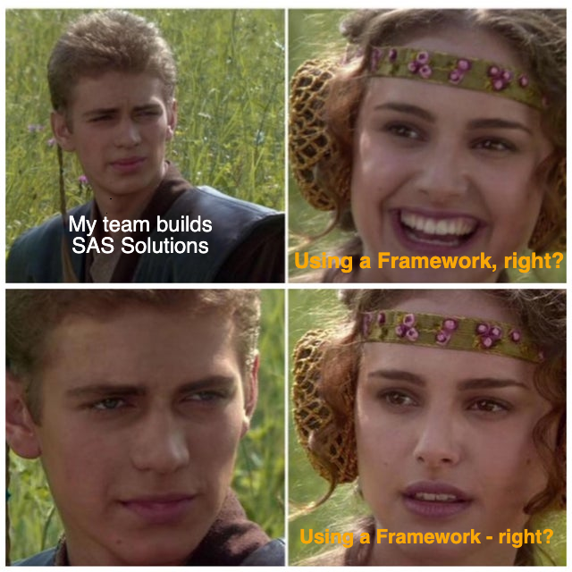

<!-- header:  -->

# SASjs
## DevOps for SAS

---

<!-- header:  -->

# Challenges with Traditional SAS Projects

- Scattered Artefacts > _Hard to navigate - changes are lost_
- Shared Environment > _Edits affect everyone_
- Single Server >  _Migration Management_

 

🤬🤬🤬 **The absence of a _standardised framework_ makes for _inconsistent project delivery_ and _on-boarding struggles_ for new developers**

---

# Why use SASjs?

- Open source - use everywhere
- Faster iterations / time to value
- Work locally with your preferred tools

<!--
* MIT licence, no restrictions.  Any version of SAS
* Single command to deploy to a server, one more to run the tests. Share config between developers.
* VS Code has a plugin but the CLI can also do everything.
-->

---

# What is SASjs?

1. An Opinionated Approach for SAS Solution Delivery
2. A Collection of Tools
    - [@sasjs/cli](https://github.com/sasjs/cli) - CI/CD and Automated Deployment
    - [@sasjs/core](https://github.com/sasjs/core) - Macro library
    - [@sasjs/vscode-extension](https://github.com/sasjs/adapter) - Battery Pack for VS Code
    - [@sasjs/server](https://server.sasjs.io) - Build Apps on Base SAS

<!-- optionated - working locally, git centric, server agnostic -->

---

## SASjs Workflow

 ---

# SASjs Projects

- Push to Any or Many > _Server Agnostic_
- Centralised Artefacts > _Source Controlled_
- Isolated Developer Environments > _Move Fast and Break Things_

 

✅ Highly suitable where SAS Programming is involved
❌ Needs additional work for graphical artefacts (VA, Flows etc)

---
# Why Do SAS Admins ❤️ It?

 - Nothing to install or provision on the SAS server
 - No SSH nor special permissions needed anywhere
 - Nothing to configure, except:
     - Optional: Access to the target folder
     - Optional: Client / Secret (Viya)
     - Optional: SAS 9 setting for encoded passwords

---
# Why Do Project Leads ❤️ It?

 - Faster to on-board new developers
 - Ability to work on multiple features in parallel
 - Complete visibility of what is being developed

---
## SASjs Config File

Every SASjs Project has a `sasjs/sasjsconfig.json` file, for configuration of:

 - Location of Artefacts (+ Dependencies & Init/Term programs)
 - Macro Variables
 - Target attributes / connection settings

---
# 🎯 SASjs Target 🎯

*A location on a SAS server*

Core attributes:

 - `name` > Alias for SASjs commands, eg: `sasjs deploy -t dev3`
 - `serverUrl` > Protocol + Host + Port
 - `serverType` > either `SASVIYA`, `SAS9` or `SASJS`
 - `appLoc` > Root deployment folder in SAS Drive or Metadata

---

# Running SAS

- `sasjs run` > _Execute arbitrary SAS code_
- `sasjs job execute` > _Run a Job_
- `sasjs flow execute` > _Run a collection of Jobs_

_But - how to run a remote job with local macros???_

---
## Compilation - Scaffolding Consistency

---
## Compilation Components

_Targets are compiled by reference to the dependencies listed in the program header._

- Artefacts: **Jobs, Services, Tests**
- Dependencies: **Macros, Includes, Binary Files**
- Optional Frontend - convert a web project into a [streaming app](https://sasapps.io/blog/).

---

# `sasjs cbd`

- `sasjs compile` > _Self-contained Jobs, Services & Tests_
- `sasjs build` > _Deployment pack (JSON / SAS Program)_
- `sasjs deploy` > _Send to target location_

---

# Being a Responsible Developer

- `sasjs test` > _Trigger one or more Tests_
- `sasjs lint` > _Check Code Quality / Best Practices_
- `sasjs doc` > _Generate docs (+ lineage) from program headers_

More commands at https://cli.sasjs.io

---
# CLI Pre-Requisites

|Required|Recommended|Recommended|
|---|---|---|
|||

To install the CLI:  `npm i -g @sasjs/cli`

---
# Cloud Container

For the workshop, we recommend https://gitpod.io (github codespaces is a good alternative option).

All you need to do, is open the URL below, and log in with your existing github, gitlab, or bitbucket account.

[https://gitpod.io/#/github.com/sasjs/template_jobs](https://gitpod.io/#/github.com/sasjs/template_jobs)

---
# Demo

`sasjs create mydemo --template jobs`
`sasjs lint`
`sasjs doc`
`sasjs auth`
`sasjs cbd`
`sasjs test`

---

# Resources

- https://sasjs.io/resources
- https://datacontroller.io
- https://github.com/sasjs
- https://cli.sasjs.io
- https://sasapps.io

