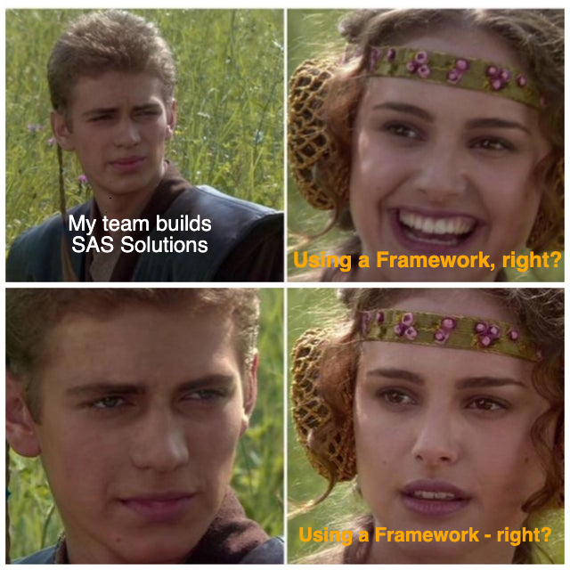
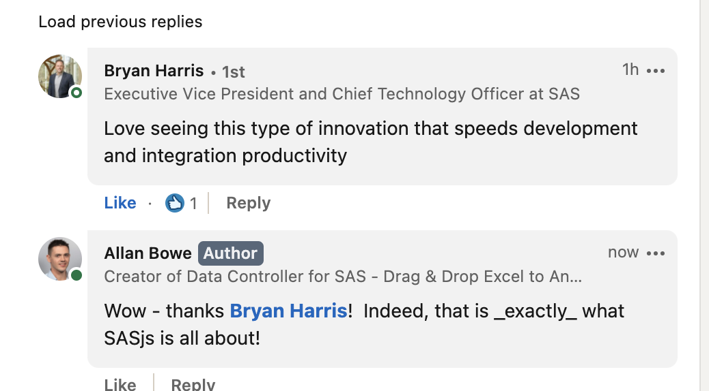
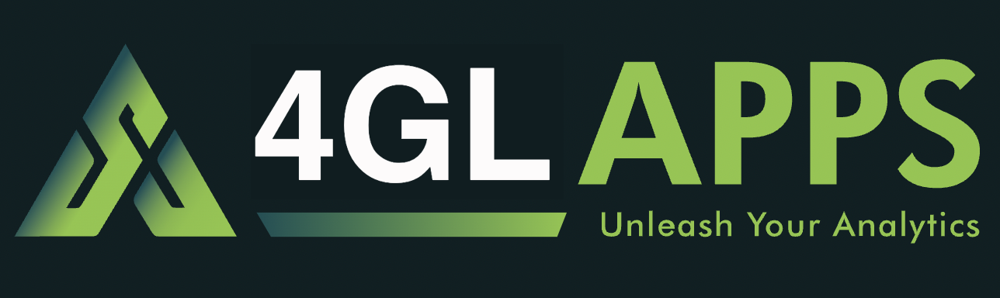
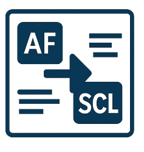

<!--
npx @marp-team/marp-cli slides/overview.md -o overview/index.html --html=true
-->

# SASjs Overview

## Tech Summary, Stakeholder Benefits, Company Info



---

<!-- header:  -->

# What is SASjs?

1. A **Collection of Open-Source Tools** 
2. A **DevOps Framework** purpose-built for SAS Viya




---

# The Problem We Solve

Home-grown projects often suffer from:

- 📂 **Scattered Artefacts** > _Hard to navigate, changes get lost_
- 👥 **Shared Environments** > _Edits affect everyone_
- 🐌 **Slow On-Boarding** > _No standard project structure_
- 🧩 **Manual Deployments** > _Click-ops, hard to reproduce_

🤬 _Inconsistent delivery, brittle releases, expensive ramp-up_

---

# The SASjs Approach

- ✅ **Centralised Artefacts** > _Source controlled, assets mapped_
- ✅ **Isolated Dev Environments** > _Move fast, break nothing_
- ✅ **Standardised Project Layout** > _Onboard in hours, not weeks_
- ✅ **Automated Deployment to Viya** > _Runs in Pipeline_

Purpose-built for **SAS Viya**.


---

# Core Components

| Component | Purpose |
|---|---|
| [`@sasjs/cli`](https://cli.sasjs.io) | CI/CD, lint, doc, test |
| [`@sasjs/core`](https://core.sasjs.io) | SAS Macro library (~250 macros) |
| [`@sasjs/adapter`](https://adapter.sasjs.io) | JS ↔ Viya connector (browser/Node) |

_Actively / continuously maintained since **July 2020**_


---

# `@sasjs/cli` — The Heart of the Framework

| Command | Description |
|---|---|
| `sasjs cbd` | Deploy to Viya in one step |
| `sasjs test` | Run unit / integration tests |
| `sasjs lint` | Enforce code quality  |
| `sasjs doc` | Auto-generate documentation |

_Executes locally (laptop), or in a pipeline. Developer Tool only._

---

# `@sasjs/core` — Macro Library


<table>
  <tr>
    <td></td>
    <td></td>
    <td></td>

  </tr>
</table>

- ~250 Production-grade SAS macros
- Auto-documented at [core.sasjs.io](https://core.sasjs.io) 


_Swept into relevant programs and deployed to Viya within Jobs._

---

# `@sasjs/adapter` — JS ↔ Viya Bridge

- Connects **any web frontend** to **SAS Viya**
- Handles auth, sessions, log capture, debug mode
- SASLogon redirect (retain app state on session expiry)
- Built on the Viya **Job Execution Service** REST APIs

```js
const adapter = new SASjs({ serverType: 'SASVIYA', appLoc: '/Public/app' })
const { data } = await adapter.request('services/myService', { table1: [...] })
```


---

# Benefits — SAS Admins 🛡️

- ✅ **Nothing to install** on the SAS server
- ✅ **No SSH** / file server access needs to be granted
- ✅ **No CSP changes** or other downgrades to Viya default security
- ✅ Works through standard SAS APIs only

_Zero-footprint, zero-risk adoption._

---

# Benefits — Project Leads 📋

- ⚡ **Faster on-boarding** of new developers
- ⚡ **Faster development** thanks to rapid build/test cycle
- 🔁 **Reproducible deployments** 
- 💰 **Lower TCO** through automation and reuse
- 📉 Lower delivery risk, predictable timelines

---

# Benefits — End Users 👥

- 🚀 **Faster delivery** of new features
- 🐛 **Higher quality** through automated testing
- 📱 **Modern web UIs** powered by SAS
- 📚 Built-in **documentation** 


---

# Who Uses SASjs 🌍

- 🏛️ **Government** — UK, USA, Sweden
- 🏦 **Banks** — Canada Western Bank, Jyske Bank, HSBC
- ☂️ **Insurance** — Allianz, AFA, Federale, LVM, Ergo, P&V
- 🏢 **Enterprise** — Der Touristik, Siemens Healthineers
- 🔬 **SAS R&D** — used internally by SAS Institute teams
- 🏢 **Consultancies & SAS Partners** worldwide

_Trusted in regulated industries where audit, reproducibility & quality matter._


---

<!-- header:  -->

# About 4GL Apps


- 🇬🇧 **UK Limited Company** since 2013
- **SAS Subcontractor** — UK, USA, Belgium, Sweden
- **Singular Focus:** SAS Powered Web Apps
- **Size:** 10 People
- Founded by **Allan Bowe**, ex-SAS Institute


---

<!-- header:  -->

# Our Products

| Data Controller for SAS® | AF/SCL Transcoding Kit | SASjs |
|:---:|:---:|:---:|
| [](https://datacontroller.io) | [](https://sasensei.com) | [](https://sasjs.io) |

_SASjs underpins Data Controller and AF/SCL modernisation deliveries / support contracts.  Hence, **4GL Apps will continue to maintain & support SASjs**_.


---
<!-- header:  -->

# Our Services


- **Modernisation** — AF/SCL + SAS/IntrNet 
- **Migration** — STP web apps → Viya
- **Manifestation** — bespoke SAS web apps
- **Support** — long-term partnerships

---

# Selected Projects

- 🇬🇧 **400-user AF/SCL modernisation**, Allianz UK
- 🇬🇧 **AF/SCL Data Management system**, UK Gov
- 🇩🇪 **Demand Planning Tool**, Der Touristik
    - Re-engaged for app extension, same client
- 🇸🇪 **SOAP Interface to Viya**, Swedish Gov
- 🇺🇸 **AF/SCL Modernisation**, US Gov

_Plus many more across regulated industries._


---

# Resources

- 🌐 [sasjs.io](https://sasjs.io) — main site & resources
- 📚 [cli.sasjs.io](https://cli.sasjs.io) — CLI docs
- 📚 [core.sasjs.io](https://core.sasjs.io) — macro library docs
- 🎤 [slides.sasjs.io](https://slides.sasjs.io) — all presentations
- 💼 [datacontroller.io](https://datacontroller.io) — Data Controller
- 🚀 [4gl.io](https://4gl.io) — 4GL SAS Apps services
- 🐙 [github.com/sasjs](https://github.com/sasjs) — source code

