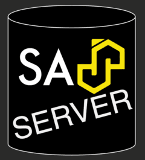
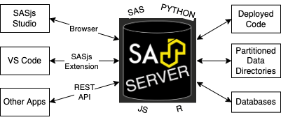

<!--

npx @marp-team/marp-cli ./slides/platform.md -o ./platform/index.html --html=true

-->

<!-- header:  -->

# Platform Hosting

---

# About 4GL Apps

 - UK Ltd (since 2013)
 - SAS UK Subcontractor
 - Focus: **SAS Solutions**

---
<!-- header:  -->

# Products

- Data Controller for SAS® - for regulated industries
- Sasensei - quiz game with 5000 SAS geeks
- SASjs - DevOps / AppDev Framework

---

# Customers

* Allianz (Belgium)
* Department of Work & Pensions (UK)
* Siemens Healthineers (Germany)
* Der Touristik / REWE (Germany)
* SKR (Sweden)

---

# Hosting Options

BYOL for SAS.  We support all major SAS platforms:

* Viya 3.5 or Viya 4
* SAS 9 EBI on Linux
* SASjs Server / Foundation-only

---

# Platform Management Services

- Server Setup (VPN, Custom Domain, Filesystem, SSL, patches, recoveries etc)
- Server Maintenance (upgrades, user management, alerts, promotions etc)
- Training & Documentation (SOPs, Online Docs, Video Guides)
- Platform Development & Extensions
- Support Desk
- Consulting

---

# SASjs Platform

In addition to Viya and/or regular SAS 9, we can also support pure SASjs Server deploys

---

# Why Use an Open Source SAS server?

- VERY low running & setup costs
- Highly extendable
- Specific use cases (eg ringfenced environments)

---
## SASjs Server Features

- Multiple runtimes (SAS, Python, R, JS)
- Users, Groups, Permissions (+ LDAP)
- SASjs Studio, Drive, STPs, Apps
- REST API

---
# Integrations

- [sasjs/cli](https://github.com/sasjs/cli) - run CLI commands including `sasjs deploy` and `sasjs test`
- [sasjs/vscode-extension](https://github.com/sasjs/vscode-extension) - execute Base SAS from VS Code
- [sasjs/adapter](https://github.com/sasjs/adapter) - connect to Base SAS using JavaScript
- [sasjs/core](https://github.com/sasjs/core) - macro library preconfigured

---
# Resources

- https://github.com/sasjs/server
- https://datacontroller.io
- https://server.sasjs.io
- https://sasapps.io
