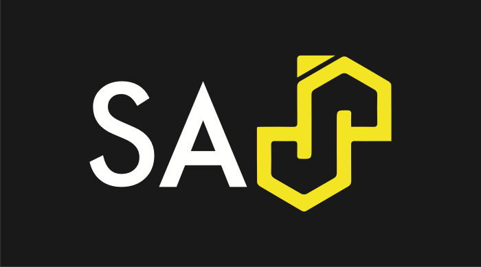

<!-- header: -->

# SASjs - the DevOps Framework for SAS
## Allan Bowe

---
<!-- header: -->

# 4GL Apps - about

- UK Company
- SAS Subcontractor
- Focus on SAS Solutions

---
# 4GL Apps - Products

- Data Controller for SAS
- SASensei
- SASjs

---
# 4GL Apps - Solutions

- SAS App Modernisation (AF/SCL + SAS/Intrnet)
- SAS App Migration (STP web apps to Viya)
- SAS App Manifestation & Support

---
# 4GL Apps - Customers

- UK (Department of Work & Pensions, Lloyds List Intelligence)
- Germany (Der Touristik, Siemens Healthineers)
- US, Italy (SAS Institute)
- Sweden (AFA, SKR)
- Belgium (Allianz)
- Denmark, Netherlands, and Canada in pipeline

---

# Demo - Data Controller

- https://datacontroller.io
- https://docs.datacontroller.io
- https://demo.datacontroller.io
- https://code.datacontroller.io

---

# Challenges with Traditional SAS Projects

- Scattered Artefacts > _Hard to navigate - changes are lost_
- Shared Environment > _Edits affect everyone_
- Single Server >  _Migration Management_

 

🤬🤬🤬 **The absence of a _standardised framework_ makes for _inconsistent project delivery_ and _on-boarding struggles_ for new developers**

---

## SASjs Workflow

---

# Why Do SAS Developers ❤️ It?

 - Use preferred IDE > _VS Code / Sublime / Vim_
 - Access to the terminal > _Shell scripts, Python_
 - Access to local applications > _GIT GUI / Doxygen_

---

# Why Do SAS Admins ❤️ It?

 - Nothing to install or provision on the SAS server
 - No SSH nor special permissions needed anywhere
 - Nothing to configure, except:
     - Optional: Access to the target folder
     - Optional: Client / Secret (Viya)
     - Optional: SAS 9 setting for encoded passwords

---
# Why Do Project Leads ❤️ It?

 - Faster to on-board new developers
 - Ability to work on multiple features in parallel
 - Complete visibility of what is being developed

---

## SASjs Stats

- 100% MIT open source
- Over 55k downloads
- ~ 20 contributors
- 35 Repositories
---

# SASjs Framework

1. An Opinionated Approach - _which led to the development of:_
2. A Collection of Tools for SAS Solution Development
    - @sasjs/core - Macro library
    - @sasjs/server - Web Server & REST API for Base SAS
    - @sasjs/vscode-extension - both VS Code and VSCodium
    - @sasjs/cli - CI/CD and Automated Deployment

---
# SASjs Core

- ~250 macros for application development
- Documentation + Tests
- Base SAS, Viya, Metadata, SASjs Server

---
# SASjs Server

_A Web Server and REST API for Base SAS_

- SASjs Drive for content
- SASjs Studio for code execution
- SASjs AppStream for deployed Apps

---

# SASjs VS Code Extension

- Works on all SAS Platforms
- Supports VS Codium, Theia
- Run SAS code & fetch log
- Sync local/remote dirs
- Includes sasjs/lint
- Target Management

---

# SASjs CLI - Execution

- `sasjs run` > _Execute arbitrary SAS code_
- `sasjs job execute` > _Run a Job_
- `sasjs flow execute` > _Run a collection of Jobs_

---

# SASjs CLI - Deployment

- `sasjs cbd` > _Compile, Build, & Deploy_
  * Compiled Jobs / Services / Tests
  * Freeform Logical Content (`syncFolder` path)
  * Freeform Physical Content (`syncDirectories` array)

---

# SASjs CLI - Extra Goodies

- `sasjs lint` -> capture SAS coding issues prior to `git push`
- `sasjs doc` -> generate HTML docs for an entire SAS project
- `sasjs test` -> deploy self-contained tests for Jobs, Services & Macros

---

# SASjs Framework - Extra Goodies

- Seed apps to kick start a project (Angular, React, Vanilla JS, Electron, Jobs-only, Docs-only)
- SASjs/utils library - import features directly into your own products
- Support Channel - https://matrix.to/#/#sasjs:4gl.io

---

# Allan Bowe, Chief SAS App Officer

📅 https://4gl.uk/book
💬 https://matrix.to/#/@allan:4gl.io
🔗 https://www.linkedin.com/in/allanbowe/

