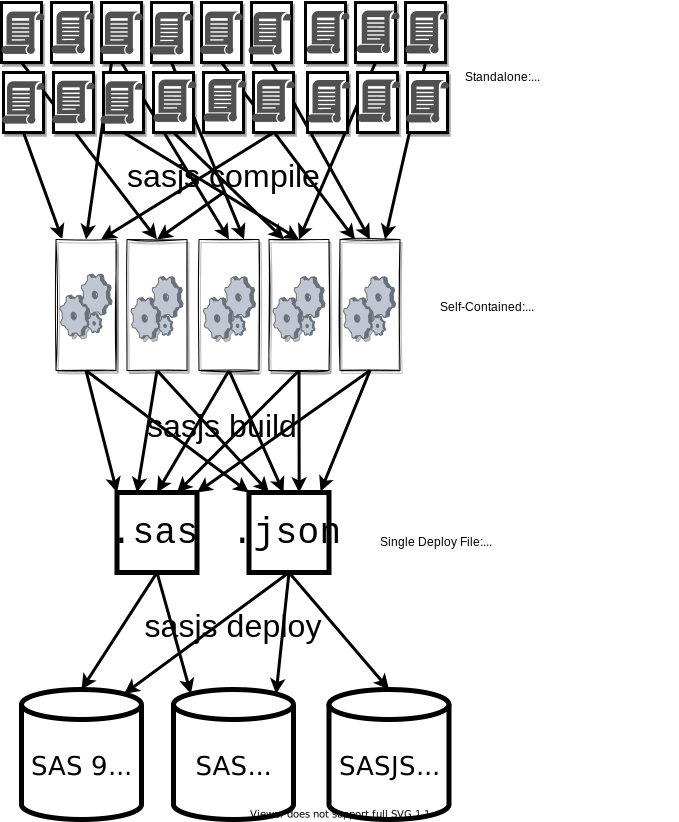

<!-- header:  -->

<style>
section {
  /* change default font to Arial (or similar fallbacks) */
  font-family: Arial, Helvetica, sans-serif;
}
</style>

# `sasjs test`


https://slides.sasjs.io/test


---

<!-- header:  -->

# Why use SASjs?

- Open Source (MIT) & Actively Developed
- Faster iterations / time to value
- Work locally with your preferred tools

<!--
* MIT licence, no restrictions.  Any version of SAS
* Single command to deploy to a server, one more to run the tests. Share config between developers.
* VS Code has a plugin but the CLI can also do everything.
-->

---

# Why Write Tests?

 - Eliminate Time / Cost of Manual Testing
 - Avoid Regression from Code Changes
 - Documenting the Process


---

# Why use SASjs for Tests?

- Run each test in isolated session
- Easily rerun tests in debug mode
- Test Setup / Teardown routines
- Integration with `sasjs doc`
- Test Coverage reports

---

# What is SASjs?

1. An Opinionated Approach for SAS Solution Delivery
2. A Collection of Tools
    - [@sasjs/cli](https://github.com/sasjs/cli) - CI/CD and Automated Deployment
    - [@sasjs/core](https://github.com/sasjs/core) - Macro library
    - [@sasjs/vscode-extension](https://github.com/sasjs/adapter) - Battery Pack for VS Code
    - [@sasjs/server](https://server.sasjs.io) - Build Apps on Base SAS

<!-- optionated - working locally, git centric, server agnostic -->

---

# What is a SASjs Test?

_A SAS program that performs one or more assertions_

Filename pattern: `[filename].test<.integer>.sas`

```
some_service.test.sas
some_job.test.0.sas
some_job.test.1.sas
```

The test integer is optional. If provided, tests execute accordingly - eg `some_job.test.0.sas` before `some_job.test.1.sas`.

---

# Creating Tests

---

# Test Body


An example of a test that provides a result:
```sas
data work.test_results;
  test_description="some description";
  test_result="PASS";
  test_comments="We did this & that happened";
  output;
run;
%webout(OPEN)
%webout(OBJ, test_results)
%webout(CLOSE)
```

---

# Assertion Macros

A number of ready made assertion macros are available in the SASjs [Core](https://core.sasjs.io) library:

* [mp_assert](https://core.sasjs.io/mp__assert_8sas.html) - generic assertion
* [mp_assertcols](https://core.sasjs.io/mp__assertcols_8sas.html) - Asserts the existence (or not) of certain columns
* [mp_assertcolvals](https://core.sasjs.io/mp__assertcolvals_8sas.html) - Asserts the existence (or not) of particular column values
* [mp_assertdsobs](https://core.sasjs.io/mp__assertdsobs_8sas.html) - Asserts the existence (or not) of dataset observations
* [mp_assertscope](https://core.sasjs.io/mp__assertscope_8sas.html) - Compares before/after to detect scope leakage in a SAS Macro

---

# Test Coverage

A SAS Service, Job or Macro is covered if there is a test with the same filename, eg:

```
├── some_service.sas
├── some_service.test.sas
├── some_job.sas
└── some_macro.test.0.sas
```

In this example, `some_service.sas` is covered, `some_job.sas` is not covered, and `some_macro.test.0.sas` is a standalone test.

Coverage is file level.  We have plans for line level - just need a sponsor!

---

# Deploying Tests

---

# SASjs Developer Workflow


---
# CLI Pre-Requisites

<style scoped>
section img {
    border-style: solid
}
</style>
|Required|Recommended|Recommended|
|---|---|---|
|||

To install the CLI:  `npm i -g @sasjs/cli`

---

# SASjs Primary Artefacts

|Type|I/O|Returns|
|---|---|---|
|Job|Data Inputs / Outputs|Success / Error|
|Service|Web Inputs / Outputs|JSON / Other Content Types|
|Test|N/A|Pass / Fail Object|

Services & Tests are compiled with `%webout()` macros, for generating JSON in SASjs format.  See also: [https://cli.sasjs.io/artefacts/](https://cli.sasjs.io/artefacts/)

---

# SASjs Secondary Artefacts

These items are bundled into each Primary Artefact when listed in the program header

* SAS Macros
* SAS Includes
* Binary Files
* initProgram
* termProgram

---
## SASjs Config File

Every SASjs Project has a `sasjs/sasjsconfig.json` file, for configuration of:

 - Location of Artefacts (+ Dependencies & Init/Term programs)
 - Macro Variables
 - Target attributes / connection settings


---
# 🎯 SASjs Target 🎯

*A location on a SAS server*

Core attributes:

 - `name` > Alias for SASjs commands, eg: `sasjs deploy -t dev3`
 - `serverUrl` > Protocol + Host + Port
 - `serverType` > either `SASVIYA`, `SAS9` or `SASJS`
 - `appLoc` > Root deployment folder in SAS Drive or Metadata

---

# `sasjs cbd` Syntax

- `sasjs compile`: _Self-contained Jobs, Services, Tests_
- `sasjs build`: _Deployment pack (JSON / SAS Program)_
- `sasjs deploy`: _Send to target_

Compile/Build/Deploy project to myTarget:  `sasjs cbd -t mytarget`




---

# Running Tests

---
# `sasjs test` Syntax

Execute all tests (default target): `sasjs test`

Execute tests in "macros" folder: `sasjs test /macros/`

Prevent pipeline fail: `sasjs test --ignoreFail`

Execute all tests starting with "mv_" and save the output in 'myresults' folder

`sasjs test mv_ --outDirectory /somedir/myresults`


---

# Resources

- https://sasjs.io/resources
- https://datacontroller.io
- https://github.com/sasjs
- https://cli.sasjs.io
- https://sasapps.io

